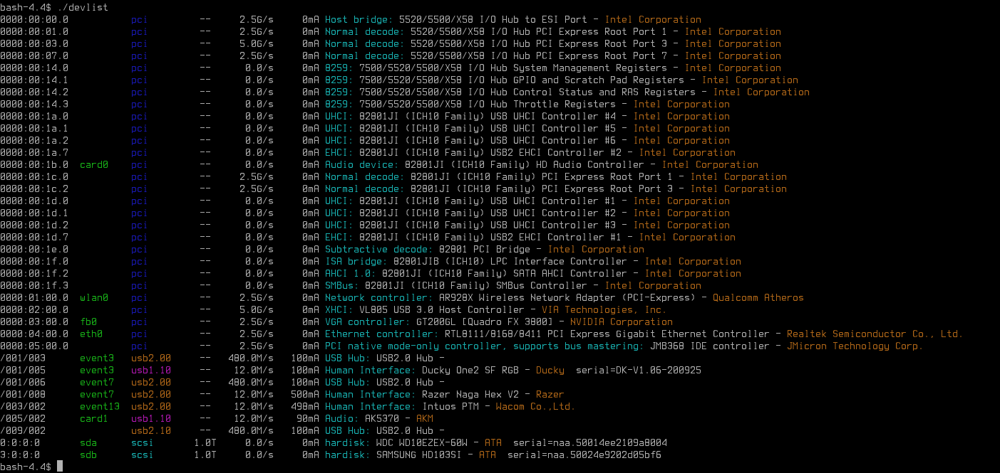

AUTHOR
======

devlist is (C) 2025 Colum Paget. They are released under the Gnu Public License so you may do anything with them that the GPL allows.

Email: colums.projects@gmail.com

DISCLAIMER
==========

This is free software. It comes with no guarentees and I take no responsiblity if it makes your computer explode or opens a portal to the demon dimensions, or does anything at all, or doesn't.


LICENSE
=======

devlist is released under the GPLv3.


SYNOPSIS
========

devlist is just another device lister for linux. It uses the linux '/sys' filesystem to gather data about devices on the pci, usb and scsi buses. In order to display device and vendor names for pci devices it uses the 'pci.ids' file from 'https://pci-ids.ucw.cz/'.


INSTALL
=======


```
./configure
make
```

You should then find an executable called 'devlist' which can be installed somewhere in your path.


USAGE
=====

```
devlist <options>
```

the default behavior without options is to display all device types .


OPTIONS
=======

```
  -pci              - print PCI devices only
  -usb              - print USB devices only
  -scsi             - print SCSI devices only
  -I <path>         - path to pci.ids file if not in standard places
  -?                - print this help
  -help             - print this help
  --help            - print this help
  --version         - print version
```


PCI.IDS FILE
============

The pci.ids file is required to look up pci device names. It should be preinstalled on most linux systems. By default devlist looks for it in '/usr/share', /usr/share/misc' and '/usr/share/lshw'. The file can be compressed using gzip or bzip2, and thus the names 'pci.ids.gz' and 'pci.ids.bz2' are searched for in addition to 'pci.ids'.

If your pci.ids file is stored in an unusual place then you can use the '-I' flag to provide the path to it.


SCREENSHOT
==========


